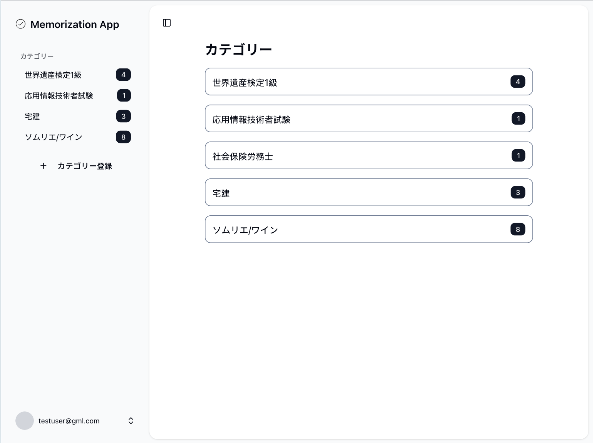

# Memorization App

***
このアプリは暗記アプリです。暗記したいものをマークダウンで書いて、今日覚える暗記が何かを教えてくれます。適切な復習時期を効率的に復習することができます※。React、Next.js、TypeScript、Supabase を使用し、認証機能・CRUDを実装しています。
 
※ エビングハウスの忘却曲線を採用

## デモページ

https://memorization-app-today.vercel.app

### デモ用認証情報
メールアドレス: testuser@gml.com
 
パスワード: testuser

## 機能一覧
- マイページ：登録した暗記カテゴリーを参照するページです
  - 暗記カテゴリー追加
  - 暗記カテゴリー選択
  - ログアウト
- 暗記アイテム学習ページ：選択した暗記カテゴリーに含まれる暗記アイテムを暗記するページです
  - 中断機能
  - 解答表示・非表示機能
  - 戻る機能
  - 明日もう一度見る機能
  - 覚えた機能
  - カテゴリー名変更機能
  - カテゴリー削除機能
- 暗記アイテム参照ページ：今まで登録した暗記アイテムを一覧で参照するページです
  - ソート機能・更新日毎
  - ソート機能・覚えた回数毎
  - 暗記アイテム編集機能
  - 暗記アイテム削除機能
  - 暗記アイテム作成機能
  - カテゴリー名変更機能
  - カテゴリー削除機能
- 暗記アイテム作成・編集ページ
  - マークダウンで作成・編集機能
  - 登録機能

## 技術一覧
### フロントエンド
- Next.js 14（App Router 使用）
- React 19
- Tailwind CSS（UI スタイリング）
- Shadcn/ui（UI コンポーネント）
- React Hook Form

### バックエンド
- Next.js API Routes
- Supabase（PostgreSQL）

### 認証
- Supabase（メール認証・Google認証）

### ホスト
- Vercel
  
### 型
- zod（スキーマバリデーション）
- TypeScript

### DB設計
- 参照
 
https://github.com/Faron-17/memorization-app/blob/main/doc/erd.md