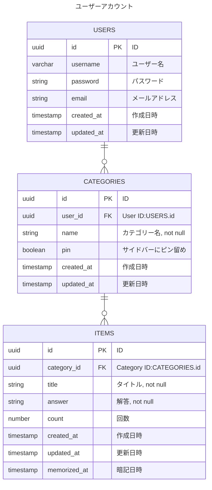

# ER図

## Memorization App データベース

## 補足
- 画面各所に出すバッジ数値は、アプリを開いた日にその日は何個暗記するものがあるかの合計を通知する
- バッジ数値のカウント方法は、暗記項目一つ一つに対し、ITEMSのcountとmemorized_atを用いて、アプリを開いた当該日時に暗記するべきか否かを計算する
- 例）countが1、memorized_atが昨日→今日は暗記すべき→バッジ数値に加算
- 例）countが2、memorized_atが昨日→今日は暗記すべきでない→バッジ数値に加算しない
- 今回はcount3までを計算対象とし、4からは加算対象としない
- count=nに対し、何日後に暗記対象かの計算は設定ファイルをコード上に持つ