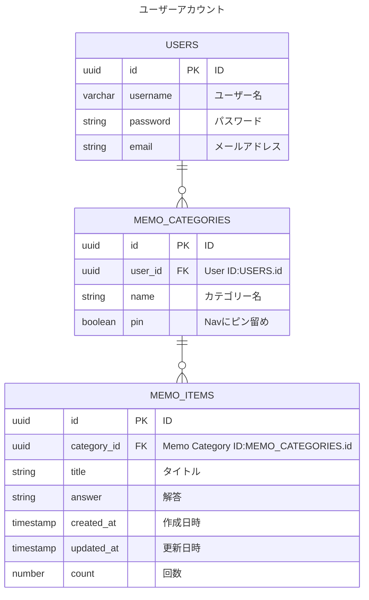

# ER図

## Memorization App データベース

## 補足
- 画面各所に出すバッジ数値は、DBでは持たない。今日の日付とupdated_at、countを比較して、バッジ数値として加算されたりされなかったりする。countは3以上の場合は比較対象にならない。count=1, count=2, count=3は何日後に加算対象となるか、などといった設定ファイルをコードで持つ想定
- USERS DB：メールアドレスとOAuth認証（google）